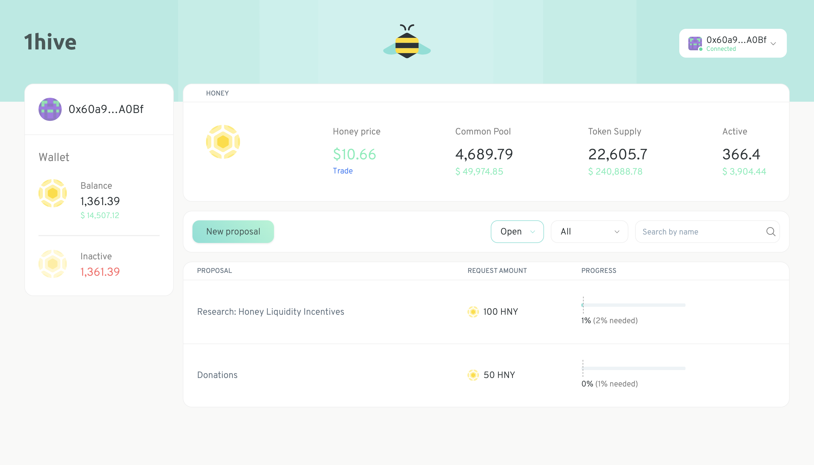

# Honey pot :honey_pot:

### Karma template frontend using @aragon/connect.

<a href="https://1hive.org/#/"></a>

How to run locally:

#### Clone the repository
```
git clone https://github.com/1Hive/honey-pot.git
```

#### Install dependencies
```
cd honey-pot
yarn --ignore-engines
```

#### Start UI
```
yarn start:[network]

# yarn start:rinkeby
# yarn start:xdai
```

### Environment variables


```
REACT_APP_APP_NAME # Name of the app (if empty, defaults to conviction-voting)
REACT_APP_ORG_ADDRESS # Address of the organization (if empty, defaults to address specified in netowrks.js file)
```
