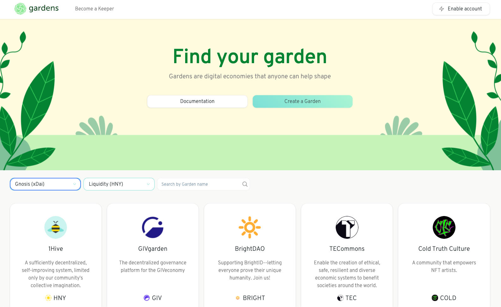

# Gardens UI <a href="https://gardens.1hive.org/"></a>

## Gardens are secure digital economies run by the community members that make them valuable.

<a href="https://gardens.1hive.org/#/"></a>

## How to run locally

#### Clone the repository

```
git clone https://github.com/1Hive/gardens-ui.git
```

#### Install dependencies

```
cd gardens-ui
yarn
```

#### Start UI

```
yarn start
```

### Environment variables

```
REACT_APP_GITHUB_API_TOKEN # API token for GitHub used to fetch Gardens metadata.
REACT_APP_PINATA_API_TOKEN # API token for Pinata used to pin IPFS content.
REACT_APP_POLYGON_ETH_NODE # Env to set a custom node on Polygon.
REACT_APP_XDAI_ETH_NODE # Env to set a custom node on xDai.
REACT_APP_RINKEBY_ETH_NODE # Env to set a custom node on Rinkeby.
REACT_APP_PORTIS_ID # App ID to setup Portis provider.
REACT_APP_POCKET_API_KEY # API key for Pocket to setup a ethers default provider connected to multiple nodes.
REACT_APP_ALCHEMY_API_KEY # API key for Alchemy to setup a ethers default provider connected to multiple nodes.
REACT_APP_ETHERSCAN_API_KEY # API key for Etherscan to setup a ethers default provider connected to multiple nodes.
REACT_APP_INFURA_API_KEY # API key for Infura to setup a ethers default provider connected to multiple nodes.
```
